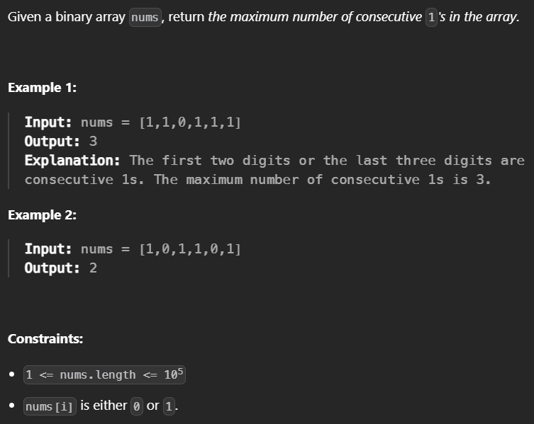

# Problem statement



### 21-ms: C++ code

```cpp
class Solution {
public:
    int findMaxConsecutiveOnes(vector<int>& nums) {
        int count = 0 ; 
        int n = nums.size();
        int max = INT_MIN ;         
        for(int i = 0 ; i < n ; i++) {
            if(nums.at(i) == 0) {
                if(max < count){
                    max = count;
                }
                count = 0 ; 
            }
            else{
                count++ ; 
            }
        }
        if(max < count){
            max = count ;
        }
        return max ;
    }
};
```

### 7-ms: C++ code

```cpp
class Solution {
public:
    int findMaxConsecutiveOnes(vector<int>& nums) {
        ios_base::sync_with_stdio(0);
        cin.tie(0);
        cout.tie(0);
        int ans=0,sum=0;
        for(int i:nums){
            if(i==1)sum++;
            else sum=0;
            ans=max(ans,sum);
        }
        return ans;
        
    }
};
```
